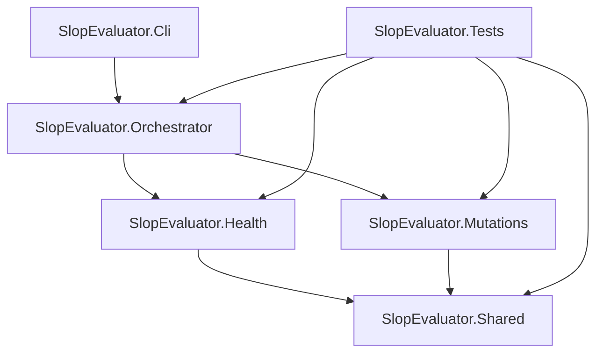
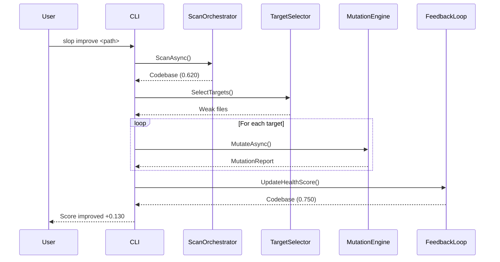

# SlopEvaluator

**Self-evaluating .NET codebase health scanner with mutation testing**

[](https://github.com/your-org/SlopEvaluator/actions/workflows/ci.yml)
[](https://dotnet.microsoft.com/)
[](#self-scan-results)
[](LICENSE)

## What It Does

SlopEvaluator scans .NET codebases across **14 health dimensions**, runs **mutation testing with 16 Roslyn-based strategies**, and provides an automated **Scan, Improve, Verify** loop. Point it at any .NET project to get a composite health score, identify weak spots, and iteratively strengthen your codebase.

## Architecture



| Project | Purpose |
|---------|---------|
| **Cli** | CLI entry point with 8 commands |
| **Orchestrator** | Integration layer: scan, improve, verify pipeline |
| **Health** | 17 collectors measuring codebase health across 14 dimensions |
| **Mutations** | Mutation engine with 16 strategies (12 AST walker + 4 structural) |
| **Shared** | Roslyn helpers, scoring interfaces, JSON defaults, process runner |
| **Tests** | Combined test suite covering all projects |

## Pipeline

The `improve` command runs the full Scan, Improve, Verify loop:



## Health Dimensions

Each dimension produces a score from 0.0 to 1.0. The composite health score is a weighted average across all 12 scored dimensions (Structure and Architecture are sub-components).

| Dimension | Weight | What It Measures |
|-----------|--------|-----------------|
| Code Quality | 15% | Cyclomatic complexity, maintainability index, code smells, null safety |
| Testing | 15% | Test coverage, mutation score, test quality, edge case detection |
| Security | 10% | Secret hygiene, auth patterns, OWASP coverage |
| Dependency Health | 8% | NuGet freshness, known vulnerabilities, version drift |
| Requirements | 8% | Story clarity, acceptance criteria, traceability |
| CI/CD Pipeline | 8% | Build reliability, deployment frequency, pipeline health |
| Observability | 7% | Logging, metrics, tracing, and alerting readiness |
| Developer Experience | 7% | Build times, tooling maturity, inner loop speed |
| Performance | 7% | Startup time, memory usage, latency, throughput |
| Documentation | 5% | README quality, API docs, ADRs, onboarding |
| Team Process | 5% | PR cycle time, review quality, knowledge distribution |
| AI Interaction | 5% | Prompt quality, token efficiency, interaction patterns |

## Mutation Strategy Catalog

SlopEvaluator uses two mutation generators: a Roslyn AST walker (12 strategies) and pluggable structural strategies (4 strategies).

### AST Walker Strategies

| Strategy | Risk | Description |
|----------|------|-------------|
| boundary | High | Flips comparison operators: `<` to `<=`, `==` to `!=` |
| boolean | Medium | Swaps logical operators: `&&` to `\|\|` |
| exception | High | Removes guard clauses and throw statements |
| null-coalescing | Medium | Alters `??` and `?.` null-handling expressions |
| increment | Medium | Swaps `++` / `--` and `+=` / `-=` |
| compound-assignment | Medium | Mutates compound assignment operators |
| string | Medium | Replaces string literals and interpolations |
| linq-chain | Medium | Swaps LINQ methods: `.First()` to `.Last()`, `.Any()` to `.All()` |
| async | Medium | Removes `await` or changes async patterns |
| semantic | Medium | Swaps semantically related methods (e.g. LINQ pairs) |
| logic-inversion | Medium | Negates boolean conditions in if/while/for |
| return-value | High | Returns default values instead of computed results |

### Structural Strategies

| Strategy | Risk | Description |
|----------|------|-------------|
| remove-guard | High | Removes entire guard clause blocks |
| remove-statement | High | Deletes individual statements |
| swap-statements | Medium | Reorders consecutive statements |
| empty-method-body | High | Replaces method bodies with empty implementations |

## Installation

```bash
# As a .NET global tool
dotnet tool install --global SlopEvaluator.Cli

# From source
git clone https://github.com/your-org/SlopEvaluator.git
cd SlopEvaluator
dotnet build
```

## CLI Commands

```
slop scan <path>              Full 14-dimension health scan
slop mutate <file> [options]  Run mutation testing on a file
slop fix <file>               Auto-generate killing tests for survivors
slop improve <path>           Scan -> identify weak -> mutate -> suggest -> rescan
slop quality <file>           Coverage + edge cases + mutations pipeline
slop history <name>           Show health score trend
slop compare <path1> <path2>  Compare two codebases
slop gate <path> --threshold  CI quality gate
```

### Example: Full Health Scan

```
$ slop scan .

  SlopEvaluator Health Dashboard
  ══════════════════════════════════════════════

  Codebase:    SlopEvaluator
  Scanned:     2026-03-25

  Dimension          Score   Weight
  ─────────────────────────────────
  Code Quality       0.920   15%
  Testing            0.850   15%
  Security           0.900   10%
  Dependencies       0.870    8%
  Requirements       0.860    8%
  CI/CD Pipeline     0.910    8%
  Observability      0.850    7%
  Developer Exp      0.880    7%
  Performance        0.870    7%
  Documentation      0.850    5%
  Team Process       0.900    5%
  AI Interaction     0.880    5%
  ─────────────────────────────────
  COMPOSITE SCORE    0.880  100%
```

### Example: CI Quality Gate

```bash
# Fail the build if health drops below 0.70
slop gate ./src --threshold 70
```

### Example: Mutation Testing

```bash
# Run mutations on a specific file
slop mutate src/Services/Calculator.cs --smart

# Auto-generate tests to kill surviving mutants
slop fix src/Services/Calculator.cs
```

## How Scoring Works

The composite health score uses a **weighted average** formula:

```
Score = Sum(dimension_score * weight) / Sum(weight)
```

Each of the 12 scored dimensions contributes its individual score (0.0 to 1.0) multiplied by its weight. The weights sum to 1.0 and are tuned to prioritize code quality and testing (15% each) while giving appropriate weight to security, dependencies, and operational concerns.

The `ScoreAggregator.WeightedAverage` method handles the computation, accepting any number of `(score, weight)` tuples. This same mechanism is used recursively within dimensions (e.g., Architecture scores its own sub-dimensions).

## Self-Scan Results

SlopEvaluator evaluates itself as proof that the tool works. The current self-scan score is **0.880**, validated on every CI run via `slop gate . --threshold 70`.

## Build and Test

```bash
# Build
dotnet build

# Run tests
dotnet test

# Release build
dotnet build -c Release

# Publish self-contained
dotnet publish SlopEvaluator.Cli -c Release -o ./publish
```

## Contributing

Contributions are welcome. Please see [CONTRIBUTING.md](CONTRIBUTING.md) for guidelines.

## License

This project is licensed under the MIT License. See [LICENSE](LICENSE) for details.
