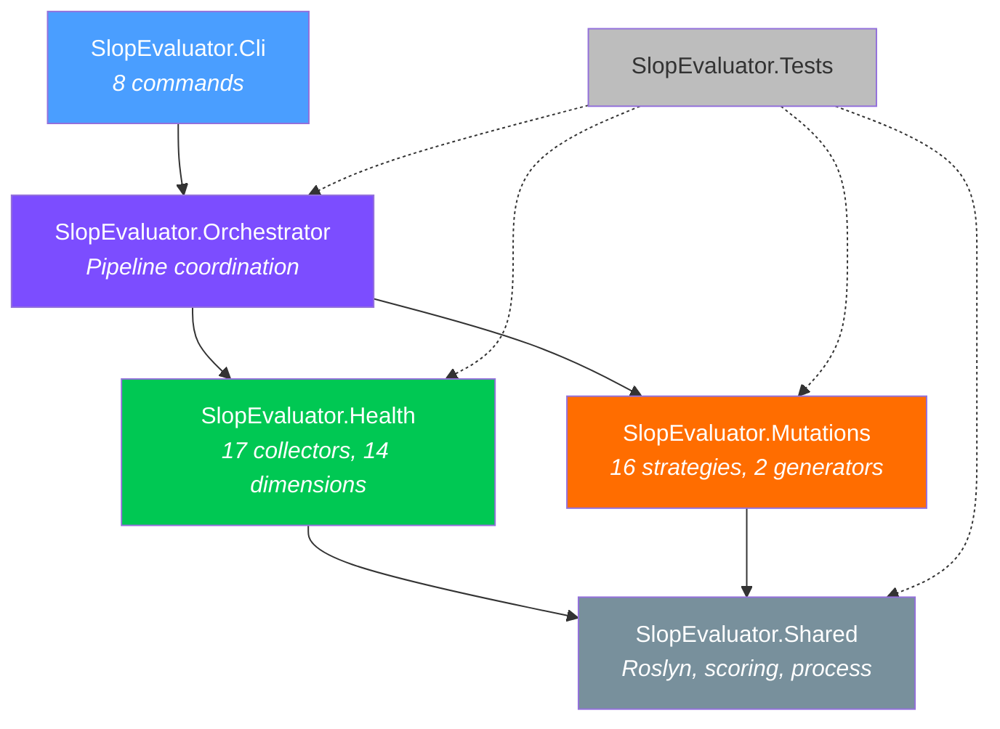
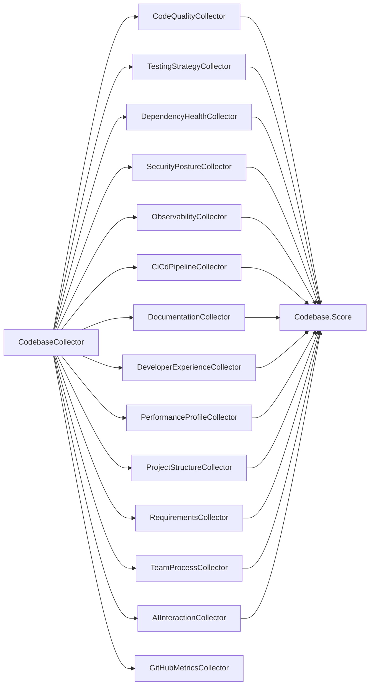
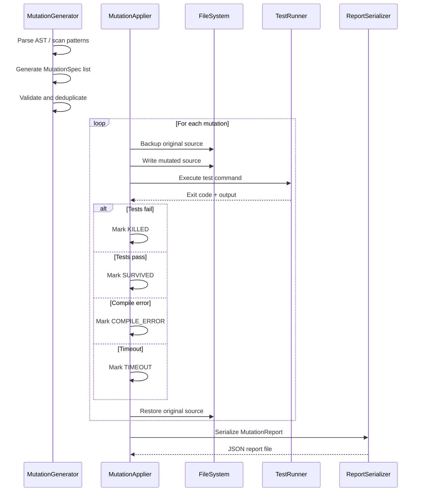
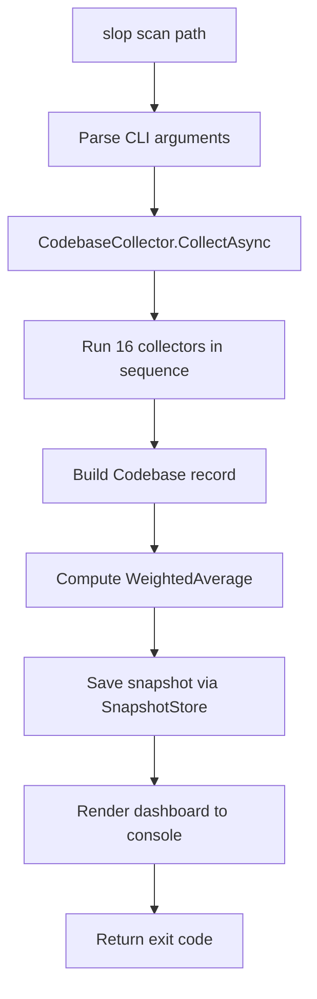
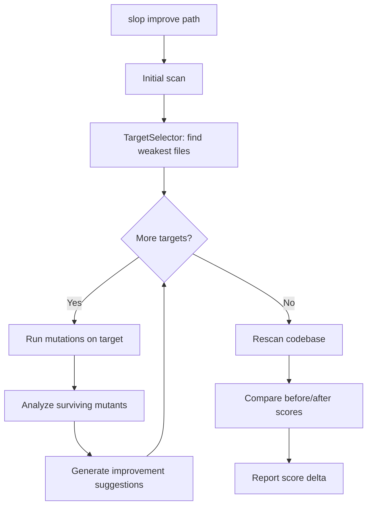
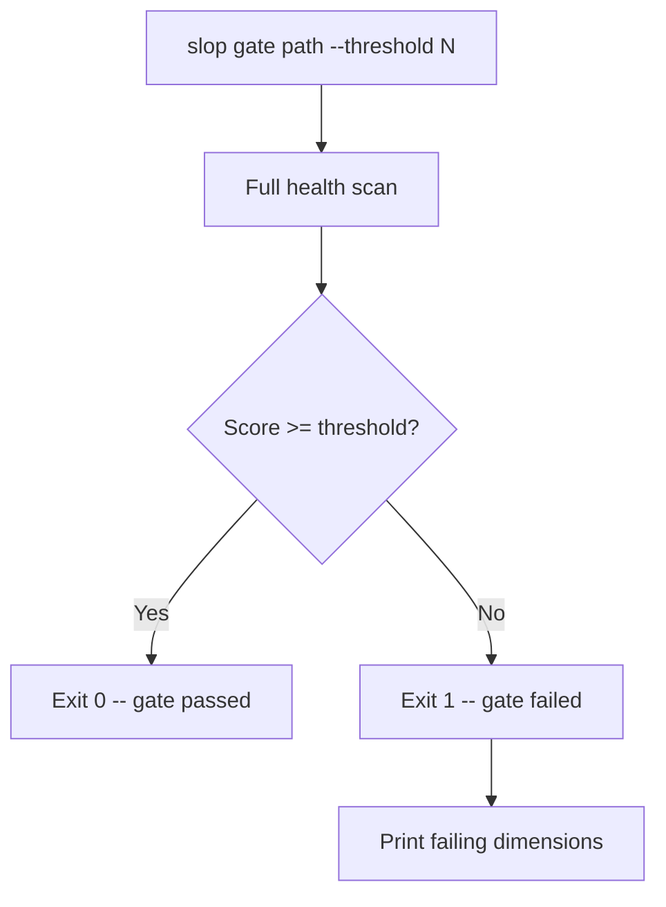

# SlopEvaluator Architecture

Deep-dive into the internal design of SlopEvaluator: project structure, collector architecture, scoring model, mutation testing lifecycle, and command flows.

## Project Structure

SlopEvaluator is a 6-project .NET 10.0 solution organized in layers.

| Project | Role | Key Contents |
|---------|------|-------------|
| **SlopEvaluator.Shared** | Foundation layer with zero business logic | Roslyn syntax helpers, `ScoreAggregator`, `IScoreable` interface, JSON serialization defaults, `ProcessRunner` for external commands |
| **SlopEvaluator.Health** | Codebase measurement engine | 17 collectors (one orchestrator + 16 dimension collectors), snapshot storage, trend analysis, health check infrastructure |
| **SlopEvaluator.Mutations** | Mutation testing engine | Two mutation generators (regex-based and Roslyn AST), 16 strategies, mutation applier, test runner, fix generator, report serializer |
| **SlopEvaluator.Orchestrator** | Integration and pipeline coordination | `ScanOrchestrator`, `ImproveOrchestrator`, `MutationOrchestrator`, `GateOrchestrator`, `TargetSelector`, `FeedbackLoop` |
| **SlopEvaluator.Cli** | User-facing CLI | 8 command handlers (`scan`, `mutate`, `fix`, `improve`, `quality`, `history`, `compare`, `gate`), argument parsing, console output formatting |
| **SlopEvaluator.Tests** | Test suite | Unit and integration tests covering all projects |

## Layer Dependency Diagram



Dependencies flow strictly downward. The CLI depends only on the Orchestrator. The Orchestrator depends on Health and Mutations. Both Health and Mutations depend on Shared. Tests reference all projects.

## Collector Architecture

The `CodebaseCollector` orchestrates 16 dimension collectors to produce a full `Codebase` measurement. Each collector implements async collection against a project path and returns a typed model that implements `IScoreable`.



### Collector Execution Flow

1. `CodebaseCollector.CollectAsync(projectPath, name)` is called
2. Each collector runs independently against the project path
3. Collectors analyze source files, config files, git history, test reports, and NuGet packages
4. Each returns a strongly-typed model (e.g., `CodeQuality`, `TestingStrategy`)
5. The `Codebase` record aggregates all models and computes the composite `Score`
6. The result is optionally persisted via `SnapshotStore` for trend analysis

### Individual Collectors

| Collector | Model | What It Analyzes |
|-----------|-------|-----------------|
| `CodeQualityCollector` | `CodeQuality` | Cyclomatic complexity, maintainability index, code smells, naming conventions, null safety |
| `TestingStrategyCollector` | `TestingStrategy` | Test coverage percentage, mutation score from reports, test quality metrics, edge case coverage |
| `DependencyHealthCollector` | `DependencyHealth` | NuGet package versions, known CVEs, version drift, deprecated packages |
| `SecurityPostureCollector` | `SecurityPosture` | Hardcoded secrets, auth patterns, OWASP Top 10 coverage, security headers |
| `ObservabilityCollector` | `Observability` | Structured logging, metrics endpoints, distributed tracing, alert configuration |
| `CiCdPipelineCollector` | `CiCdPipeline` | CI config presence, build steps, deployment stages, artifact management |
| `DocumentationCollector` | `Documentation` | README quality, XML doc coverage, ADR presence, onboarding guides |
| `DeveloperExperienceCollector` | `DeveloperExperience` | Build time measurement, editor config, tooling maturity, inner loop speed |
| `PerformanceProfileCollector` | `PerformanceProfile` | Startup time, memory allocation patterns, async usage, throughput indicators |
| `ProjectStructureCollector` | `ProjectStructure` | Solution layout, project count, naming conventions, folder organization |
| `RequirementsCollector` | `RequirementsQuality` | Story clarity, acceptance criteria completeness, traceability to code |
| `TeamProcessCollector` | `TeamProcessMetrics` | PR cycle time, review participation, knowledge distribution from git log |
| `AIInteractionCollector` | `AIInteractionQuality` | Prompt specificity, token efficiency, interaction patterns |
| `GitHubMetricsCollector` | _(feeds into Process)_ | Issue/PR velocity, label usage, contributor distribution |

## Scoring Model

### Composite Score Formula

The composite health score uses `ScoreAggregator.WeightedAverage`:

```
Score = Sum(score_i * weight_i) / Sum(weight_i)
```

where each `(score_i, weight_i)` pair represents one of the 12 scored dimensions.

### Weight Distribution

```
Code Quality ........... 0.15  (15%)
Testing ................ 0.15  (15%)
Security ............... 0.10  (10%)
Dependency Health ...... 0.08   (8%)
Requirements ........... 0.08   (8%)
CI/CD Pipeline ......... 0.08   (8%)
Observability .......... 0.07   (7%)
Developer Experience ... 0.07   (7%)
Performance ............ 0.07   (7%)
Documentation .......... 0.05   (5%)
Team Process ........... 0.05   (5%)
AI Interaction ......... 0.05   (5%)
                         ────
Total .................. 1.00 (100%)
```

### Recursive Scoring

Some dimensions use the same `WeightedAverage` internally. For example, the `Architecture` record computes its own score from sub-dimensions (layer separation, dependency direction, coupling, cohesion, abstraction level) and applies a penalty multiplier for circular dependencies.

### Score Interpretation

| Range | Rating | Meaning |
|-------|--------|---------|
| 0.90 -- 1.00 | Excellent | Production-grade, well-maintained codebase |
| 0.75 -- 0.89 | Good | Solid foundation with minor improvement areas |
| 0.60 -- 0.74 | Fair | Functional but needs attention in several dimensions |
| 0.40 -- 0.59 | Poor | Significant quality gaps requiring intervention |
| 0.00 -- 0.39 | Critical | Major structural issues across multiple dimensions |

## Mutation Testing Lifecycle

The mutation engine applies source-level transformations and runs the test suite to verify each mutation is detected (killed) by existing tests.



### Mutation Outcomes

| Outcome | Meaning | Action |
|---------|---------|--------|
| **Killed** | Tests detected the mutation (at least one test failed) | Good -- tests are effective |
| **Survived** | All tests still passed despite the mutation | Bad -- tests have a gap; use `slop fix` to generate killing tests |
| **Compile Error** | The mutation produced invalid C# | Neutral -- mutation was too aggressive |
| **Timeout** | Test suite exceeded the configured timeout | Investigate -- possible infinite loop or performance issue |

### Mutation Score

```
Mutation Score = Killed / (Killed + Survived)
```

Compile errors and timeouts are excluded from the score calculation. A mutation score above 0.80 indicates strong test effectiveness.

## Report Command Flow

The `scan` command orchestrates the full measurement and output pipeline:



### Improve Command Flow

The `improve` command chains scanning with targeted mutation testing:



### Gate Command Flow

The `gate` command is designed for CI pipelines:


